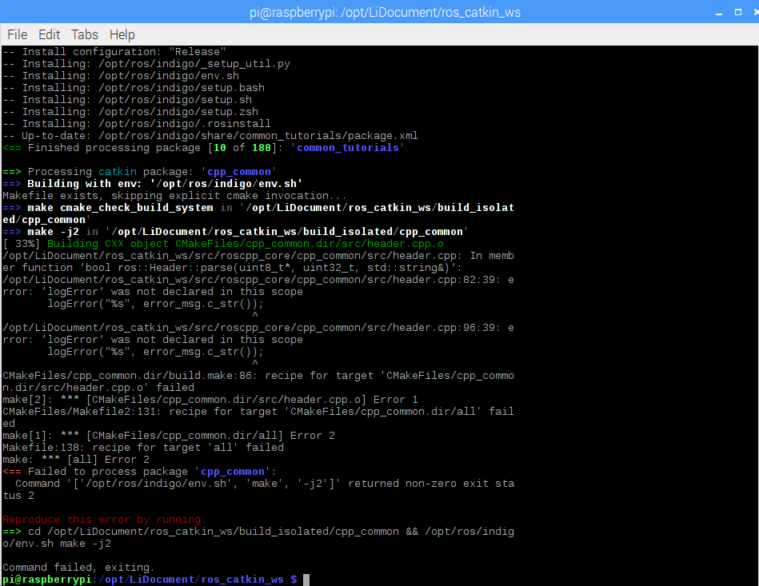

[TOC]

**树莓派3 Raspbian-jessie编译安装ROS Indigo**

树莓派准备好有一定时间了，这里记录下安装ros的过程，我的是树莓派3B 暗转buster桌面显示有点问题，最后直接推至jessie因为最早之前做小研究用过故也没有再尝试strech，在安装过程中遇到了一些问题，这里做个记录方便大家参考也方便以后自己回阅。东方赤龙博主的帖子里git clone时并未定义版本，在当时可能可以编过，但是当前很多库都有更新，本博客以方便参照官方教程，一方面参考各大神的博客最终总结。

==请千万注意，如果你要按照我的教程来安，一定要尽量不要忽略里边的任何一步，否则会有很多让人头痛的错误。==

预祝安装顺利

# 基础环境

树莓派3B Raspbian- Jessie 128G sd卡（没有必要这么大的 16G已经满足） ROS Indigo

# 安装记录

备注，之前已经配置过清华的pip源可以使用，树莓派源也替换为ustc 中科大的，如何替换可以自行搜索。

## 添加ROS代码仓库

Raspbian Jessie:

```bash
sudo sh -c 'echo "deb http://packages.ros.org/ros/ubuntu jessie main" > /etc/apt/sources.list.d/ros-latest.list'
wget https://raw.githubusercontent.com/ros/rosdistro/master/ros.key -O - | sudo apt-key add -
```

更新：

```bash
sudo apt-get update
sudo apt-get upgrade
```

## 安装相关依赖包

Raspbian Jessie:

```bash
sudo apt-get install python-pip python-setuptools python-yaml python-distribute python-docutils python-dateutil python-six
sudo pip install rosdep rosinstall_generator wstool rosinstall
```

我在安装 wstool时报错——

```
Downloading/unpacking vcstools>=0.1.38 (from wstool)
 http://pypi.douban.com/simple/vcstools/ uses an insecure transport scheme (http). Consider using https if pypi.douban.com has it available
 Downloading vcstools-0.1.42.tar.gz (54kB): 54kB downloaded
 Running setup.py (path:/tmp/pip-build-z1y5lP/vcstools/setup.py) egg_info for package vcstools
 error in vcstools setup command: &#39;extras_require&#39; must be a dictionary whose values are strings or lists of strings containing valid project/version requirement specifiers.
 Complete output from command python setup.py egg_info:
 error in vcstools setup command: &#39;extras_require&#39; must be a dictionary whose values are strings or lists of strings containing valid project/version requirement specifiers.
```

根据[Error in moviepy setup command: extras_require must be a dictionary whose values are strings or li_Python_Sarah的博客-CSDN博客](https://blog.csdn.net/Sarah_LZ/article/details/86525113)解决，方法如下：

更新setuptools:

```bash
sudo pip install --upgrade setuptools
```

重新安装成功。

## 初始化rosdep

```bash
sudo rosdep init
rosdep update
```

这一步出错的话可以看后边error 处理方法：error 111 或 cannot download default sources list from. 


# 开始安装

## 创建catkin工作空间用于编译ROS源码

```bash
sudo mkdir ~/ros_catkin_ws
cd ~/ros_catkin_ws
```

接下来我们需要下载一些核心代码包用于后续的编译，我们会用到wstool（在2.2中有说明）使用wstool命令来选择安装你想使用的版本：

官方提供了两个版本——

==重要！！！先不要采用看后边后决定==

> **ROS-Comm: (recommended)** ROS package, build, and communication libraries. No GUI tools.
> 
> ```bash
> rosinstall_generator ros_comm --rosdistro indigo --deps --wet-only --exclude roslisp --tar > indigo-ros_comm-wet.rosinstall
> wstool init src indigo-ros_comm-wet.rosinstall
> ```
> 
> **Desktop:** ROS, [rqt](http://wiki.ros.org/rqt), [rviz](http://wiki.ros.org/rviz), and robot-generic libraries
> 
> ```bash
> rosinstall_generator desktop --rosdistro indigo --deps --wet-only --exclude roslisp --tar > indigo-desktop-wet.rosinstall
> wstool init src indigo-desktop-wet.rosinstall
> ```


我在安装时遇到了，Error: the following packages/stacks could not have their rosdep keys resolved to system depengdencies，在文章后可以找到，由于在这里构建代码仓库时排除了roslisp `--exclude roslisp`所以自然是找不到roslisp，修改获取如下：

```bash
rosinstall_generator desktop --rosdistro indigo --deps --wet-only --tar > indigo-desktop-wet.rosinstall
wstool init src indigo-desktop-wet.rosinstall
```


我选用了desktop版的，如果不需要桌面仿真等一些功能，comm版应该就可以满足需求。

在安装时，可能会提示权限不足 **\**denied** 类似字眼，可以先```sudo su```切换至管理员运行窗口。

如果中途断线或下载失败，可以使用如下命令继续下载：

```bash
wstool update -t src
```

## 检查依赖项

在构建catkin工作空间之前，你需要确定所有需要的依赖项都已正确安装，我们用rosdep tool来（安装或检测？），如果有依赖项未正确安装，他们必须通过手动来安装。

### 不适用的依赖项

下边这些依赖项对于raspbian来说并不适用：

> **Raspbian Wheezy:** libconsole-bridge-dev, liburdfdom-headers-dev, liburdfdom-dev, liblz4-dev, collada-dom-dev
> 
> **Raspbian Jessie:** collada-dom-dev

下边的这些包需根据所选择的不同版本安装：

> **Ros_Comm**: `libconsole-bridge-dev`, `liblz4-dev`
>
> **Desktop**: `libconsole-bridge-dev`, `liblz4-dev`, `liburdfdom-headers-dev`, `liburdfdom-dev`, `collada-dom-dev`

我们可以创建一个新的文件夹来存放这些待编译的包：

```bash
$ mkdir ~/ros_catkin_ws/external_src
$ sudo apt-get install checkinstall cmake
$ sudo sh -c 'echo "deb-src http://mirrordirector.raspbian.org/raspbian/ testing main contrib non-free rpi" >> /etc/apt/sources.list'
$ sudo apt-get update
```

这里添加了新的源，但是我看了下更新过程依旧有运行ustc的镜像，但是*http://mirrordirector.raspbian.org*的源也有查找到更新，这样应该可以节约一些时间。

后边的git clone 经过 cmake 和 checkinstall make install的库如果安错了怎么处理，看后边的make install 卸载。

**libconsole-bridge-dev:**

下边这安装方法始终提示debhelper版本问题，执行第3行提示版本需>=11.0。解决方法见后：

```bash
$ cd ~/ros_catkin_ws/external_src
$ sudo apt-get build-dep console-bridge
$ apt-get source -b console-bridge
$ sudo dpkg -i libconsole-bridge0.2*.deb libconsole-bridge-dev_*.deb
```

~~在安装console-bridge时提示debhelper版本不满足需求，单独更新一下。~~


```bash
$ cd ~/ros_catkin_ws/external_src
$ sudo apt-get install libboost-system-dev libboost-thread-dev
$ git clone https://github.com/ros/console_bridge.git
$ cd console_bridge
$ git reset --hard c227ae0
# 注释 0.4.0 版本
```

这里需要对文件做一些处理，编辑`./include/console_bridge/console.h`

==在如下图所示的前边添加，非常重要==，否则后边一定会编译不过去，因为也没时间细找那个版本依旧用的如下定义。

```c
#define CONSOLE_BRIDGE_logError logError 
#define CONSOLE_BRIDGE_logWarn logWarn 
#define CONSOLE_BRIDGE_logInform logInform 
#define CONSOLE_BRIDGE_logDebug logDebug 
```


```bash
$ cmake .
$ sudo checkinstall make install
```


在执行 `sudo checkinstall make install`时，需注意提示如下时，第二个选项时修改第二条名称从**~~console-bridge~~** 改为 **libconsole-bridge-dev**。图如下：


**liblz4-dev**:

```bash
$ cd ~/ros_catkin_ws/external_src
$ wget http://archive.raspbian.org/raspbian/pool/main/l/lz4/liblz4-1_0.0~r122-2_armhf.deb
$ wget http://archive.raspbian.org/raspbian/pool/main/l/lz4/liblz4-dev_0.0~r122-2_armhf.deb
$ sudo dpkg -i liblz4-1_0.0~r122-2_armhf.deb liblz4-dev_0.0~r122-2_armhf.deb
```

**liburdfdom-headers-dev:**

```bash
$ cd ~/ros_catkin_ws/external_src
$ git clone https://github.com/ros/urdfdom_headers.git
$ cd urdfdom_headers
$ git reset --hard 76da8dc
# 注释 0.4.2 版本
$ cmake .
$ sudo checkinstall make install
```

在执行 `sudo checkinstall make install`时，需注意提示如下时，第二个选项时修改第二条名称从**~~urdfdom-headers~~** 改为 **liburdfdom-headers-dev**。

**liburdfdom-dev:**

```bash
$ cd ~/ros_catkin_ws/external_src
$ sudo apt-get install libboost-test-dev libtinyxml-dev
$ git clone https://github.com/ros/urdfdom.git
$ cd urdfdom
$ git reset --hard be20424
# 注释 0.4.2 版本
$ cmake .
$ sudo checkinstall make install
```

在执行 `sudo checkinstall make install`时，需注意提示如下时，第二个选项时修改第二条名称从**~~urdfdom~~** 改为 **liburdfdom-dev**。

**assimp**:

方法1：下载很慢，建议从gitee下载3.3.1版本非常快，cmake步骤相同。

```bash
$ cd ~/ros_catkin_ws/external_src
$ git clone https://github.com/assimp/assimp.git
$ cd assimp
$ git reset --hard a8673d4
# 注释 3.3.1 版本
$ cmake . -DCMAKE_BUILD_TYPE=Release -DASSIMP_BUILD_TESTS=False
$ sudo checkinstall make install
```

方法2：下载完成后解压失败

```bash
$ cd ~/ros_catkin_ws/external_src
$ wget https://github.com/assimp/assimp/archive/v3.3.1.zip
$ unzip v3.3.1.zip
$ rm v3.3.1.zip
$ cd ~/ros_catkin_ws/external_src/assimp-3.3.1
$ cmake . -DCMAKE_BUILD_TYPE=Release -DASSIMP_BUILD_TESTS=False
$ sudo checkinstall make install
```

在执行 `sudo checkinstall make install`时，需注意提示如下时，第二个选项时修改第二条名称从 **~~assimp~~**改为**libassimp-dev**。

**collada-dom-dev:**

```bash
$ cd ~/ros_catkin_ws/external_src
$ sudo apt-get install libboost-filesystem-dev libxml2-dev
$ wget http://downloads.sourceforge.net/project/collada-dom/Collada%20DOM/Collada%20DOM%202.4/collada-dom-2.4.0.tgz
$ tar -xzf collada-dom-2.4.0.tgz
$ cd collada-dom-2.4.0
$ cmake .
$ sudo checkinstall make install
```

在执行 `sudo checkinstall make install`时，需注意提示如下时，第二个选项时修改第二条名称从**~~collada-dom~~** 改为 **collada-dom-dev**。

### 使用rosdep解决依赖问题

其余的依赖项应该通过运行rosdep来解决：

*Raspbian Wheezy:*

```bash
$ cd ~/ros_catkin_ws
$ rosdep install --from-paths src --ignore-src --rosdistro indigo -y -r --os=debian:wheezy
```

*Raspbian Jessie:* 这个是我所用到的

```bash
$ cd ~/ros_catkin_ws
$ rosdep install --from-paths src --ignore-src --rosdistro indigo -y -r --os=debian:jessie
```

这步将检查src目录中的所有包，并找到它们的所有依赖项，然后它将递归地安装依赖项。

## 构建catkin工作区

一旦下载完包并解决了依赖关系，就可以构建catkin包了。

调用`catkin_make_isolated`:

```bash
$ sudo ./src/catkin/bin/catkin_make_isolated --install -DCMAKE_BUILD_TYPE=Release --install-space /opt/ros/indigo
```

**Note:** This will install ROS in the equivalent file location to Ubuntu in `/opt/ros/indigo` however you can modify this as you wish.


如果编译过程中出现错误如下 "internal compiler error"，可能是由于内存用尽造成的。对此，一个快速的解决方法是[add swap space]（http://raspberrypimaker.com/adding-swap-to-the-raspberrypi/）添加到Pi并重新编译。如果错误仍然存在，请尝试使用-j2选项而不是默认的-j4选项生成：

```bash
$ sudo ./src/catkin/bin/catkin_make_isolated --install -DCMAKE_BUILD_TYPE=Release --install-space /opt/ros/indigo -j2
```

经过不知道多少错误，终于编过了这一步！


现在ROS已经安装完成，请记住刷新安装：

```bash
$ source /opt/ros/indigo/setup.bash
```

或者（可选）在`~/.bashrc`中输入`setup.bash`，这样每次启动新shell时，ROS环境变量都会自动添加到bash会话中：

```bash
$ echo "source /opt/ros/indigo/setup.bash" >> ~/.bashrc
```


## rosdep Error处理

[借鉴——ROS- 解决 rosdep update 出现的错误](https://blog.csdn.net/Draonly/article/details/103448878)

### 现象

报错，基本如下111错误，显示连接被拒绝

```bash
reading in sources list data from /etc/ros/rosdep/sources.list.d
ERROR: unable to process source [https://raw.githubusercontent.com/ros/rosdistro/master/rosdep/osx-homebrew.yaml]:
<urlopen error [Errno 111] Connection refused> (https://raw.githubusercontent.com/ros/rosdistro/master/rosdep/osx-homebrew.yaml)
ERROR: unable to process source [https://raw.githubusercontent.com/ros/rosdistro/master/rosdep/base.yaml]:
<urlopen error [Errno 111] Connection refused> (https://raw.githubusercontent.com/ros/rosdistro/master/rosdep/base.yaml)
ERROR: unable to process source [https://raw.githubusercontent.com/ros/rosdistro/master/rosdep/python.yaml]:
<urlopen error [Errno 111] Connection refused> (https://raw.githubusercontent.com/ros/rosdistro/master/rosdep/python.yaml)
ERROR: unable to process source [https://raw.githubusercontent.com/ros/rosdistro/master/rosdep/ruby.yaml]:
<urlopen error [Errno 111] Connection refused> (https://raw.githubusercontent.com/ros/rosdistro/master/rosdep/ruby.yaml)
Hit https://raw.githubusercontent.com/ros/rosdistro/master/releases/fuerte.yaml
Query rosdistro index https://raw.githubusercontent.com/ros/rosdistro/master/index-v4.yaml
Add distro “ardent”
ERROR: error loading sources list:
<urlopen error <urlopen error [Errno 111] Connection refused> (https://raw.githubusercontent.com/ros/rosdistro/master/ardent/distribution.yaml)>
```


### 方法1  重新安装rosdep

```bash
sudo apt-get update
sudo apt-get install python-rosdep
sudo rm /etc/ros/rosdep/sources.list.d/20-default.list
sudo rosdep init
rosdep update
```

我使用方法1即连接 raw.githubusercontent.com成功，若未成功可试方法2。

### 方法2 修改/etc/hosts

```bash
sudo vim /etc/hosts
#添加如下行：
151.101.84.133  raw.githubusercontent.com
#保存后执行：
sudo rosdep update
```

若还不成功，可以重启再试一下。（networking restart也可以，但是如果是vnc的话会断网，重启还是比较方便的）

## make install 库卸载

以**liburdfdom-headers-dev**为例：

```bash
cd ~/ros_catkin_ws/external_src
sudo rm -r urdfdom_headers
sudo whereis urdfdom_headers
# urdfdom_headers: /usr/local/lib/urdfdom_headers
cd /usr/local/lib
sudo rm -r urdfdom_headers
```

对于**liburdfdom-dev**有些许不同，需要使用apt-get remove liburdfdom来删除，之后再使用上边的步骤删除usr/local/lib里的相关文件。

## E: Unable to correct problems, you have held broken packages.


[E: Unable to correct problems, you have held broken packages](https://www.cnblogs.com/aaron-agu/p/8862624.html)

```bash
sudo -H aptitude install libgl1-mesa-dev
# 选择n
# 选择Y
# 选择Y
# 三步选择，这个安装流程完成后重新运行rosdep解决依赖问题就只有一个libopencv-dev安装失败了，同样的方法解决。
```


## Error: the following packages/stacks could not have their rosdep keys resolved to system depengdencies

rosdep检查安装依赖时报如下错误，

```bash
ros_core: cannot locate rosdep definition for [roslisp]
ros_comm: cannot locate rosdep definition for [roslisp]
```

删除`--exclude roslisp`后解决该问题。


## error logError was not declared in this scope

方法1：

该问题可以通过重新安装`libconsole-bridge-dev`——前文**不适用依赖项中**的方法解决该问题。

方法2：很繁琐，之后会出很多类似问题，建议采用方法1。

我检查了所有包含的头文件，并没有声明`logError`这个函数，并且当前cpp也没有这个函数的实现，可能

是由于下载代码导致的遗留问题。



具体问题代码如下：

这段应该是输出错误的具体信息，由于log函数的问题错误信息无法导出，所以屏蔽了这个函数，在这个cpp中总共用了两次均做屏蔽，造成影响是如果这里之后出错会没有详细错误信息输出，对应用应该没有大的影响。


# 参考：

- [http://wiki.ros.org/indigo/Installation/Source](http://wiki.ros.org/indigo/Installation/Source)
- [http://wiki.ros.org/hydro/Installation/Debian](http://wiki.ros.org/hydro/Installation/Debian)

- [http://wiki.ros.org/ROSberryPi/Setting%20up%20Hydro%20on%20RaspberryPi](http://wiki.ros.org/ROSberryPi/Setting%20up%20Hydro%20on%20RaspberryPi)

- [树莓派3Raspbian-jessie编译安装ROS Indigo完整版_C/C++_超级chopper的博客-CSDN博客](https://blog.csdn.net/Super_Miao0/article/details/53571753?locationNum=11&fps=1)

- [官方指导 Installing ROS Indigo on the Raspberry Pi](http://wiki.ros.org/ROSberryPi/Installing%20ROS%20Indigo%20on%20Raspberry%20Pi)

- [ROS 学习系列 -- 树莓派编译安装完整版本ROS——东方赤龙](https://blog.csdn.net/crazyquhezheng/article/details/43413231)

- [树莓派3-Jessie编译安装ROS-indigo完整版](https://blog.csdn.net/datase/article/details/78282396)

- [Ubuntu apt-get彻底卸载软件包](https://blog.csdn.net/wsygdxg1989/article/details/79169174)

